# 实验报告：大模型魔搭社区部署推理与横向对比实践

**姓名：** 刘继业
**学号：** 2252752
**提交日期：** 2024年6月10日

本报告详细记录了在魔搭平台上部署并测试大语言模型的过程，包括环境搭建、模型下载与推理。我选择了 Qwen-7B-Chat、ChatGLM3-6B 和 DeepSeek-R1-0528-Qwen3-8B 三个模型进行 CPU 推理测试，并针对一系列中文语义理解的“刁钻”问题进行了问答测试，最后对不同模型的表现进行了横向对比分析，旨在评估它们在复杂语境理解和推理能力上的差异。

---

**一、平台搭建**

1.  **ModelScope 账户注册与登录：**
    *   访问 ModelScope 官方网站：[https://www.modelscope.cn/home](https://www.modelscope.cn/home)。
    *   点击右上角的“登录/注册”按钮，完成新用户注册并登录。

2.  **获取计算资源：**
    *   登录 ModelScope 后，进入个人首页，确保已绑定阿里云账号以获取免费的云计算资源。
    *   导航至“我的Notebook”页面，选择并启动一个 **CPU 服务器**实例（配置：8核 32GB）。
    *   **注意：** CPU 资源在1小时未使用后会自动释放，已配置的环境将被清空。

3.  **Notebook 环境配置与终端启动：**
    *   待 Notebook 环境启动成功后，点击界面中的 **Terminal 图标**，打开终端命令行环境。

4.  **环境搭建（Conda 环境路径 - 推荐）：**
    *   **检查与安装 Miniconda (如未安装)：**
        *   进入 `/opt/conda/envs` 目录：
            ```bash
            cd /opt/conda/envs
            ```
        *   下载 Miniconda 安装脚本：
            ```bash
            wget https://repo.anaconda.com/miniconda/Miniconda3-latest-Linux-x86_64.sh
            ```
        *   执行安装脚本：
            ```bash
            bash Miniconda3-latest-Linux-x86_64.sh -b -p /opt/conda
            ```
        *   将 Conda 路径添加到环境变量并刷新：
            ```bash
            echo 'export PATH="/opt/conda/bin:$PATH"' >> ~/.bashrc
            source ~/.bashrc
            ```
        *   验证 Conda 版本：
            ```bash
            conda --version
            ```
    *   **创建并激活 Conda 环境：**
        *   创建名为 `ai` 且 Python 版本为 3.10 的新环境：
            ```bash
            conda create -n ai python=3.10 -y
            ```
        *   加载 Conda 配置文件并激活新环境：
            ```bash
            source /opt/conda/etc/profile.d/conda.sh
            conda activate ai
            ```
    *   **安装基础依赖：**
        *   **检查网络连接：** 在执行以下 pip 命令前，请确保终端可以正常联网。
        *   更新 pip 工具：
            ```bash
            pip install -U pip setuptools wheel
            ```
        *   安装 PyTorch CPU 版本及其配套库：
            ```bash
            pip install \
            torch==2.3.0+cpu \
            torchvision==0.18.0+cpu \
            --index-url https://download.pytorch.org/whl/cpu
            ```
        *   安装 LLM 运行所需的基础依赖（兼容 transformers 4.33.3 和 neuralchat）：
            ```bash
            pip install \
            "intel-extension-for-transformers==1.4.2" \
            "neural-compressor==2.5" \
            "transformers==4.33.3" \
            "modelscope==1.9.5" \
            "pydantic==1.10.13" \
            "sentencepiece" \
            "tiktoken" \
            "einops" \
            "transformers_stream_generator" \
            "uvicorn" \
            "fastapi" \
            "yacs" \
            "setuptools_scm"
            ```
        *   安装 fschat (需要启用 PEP517 构建)：
            ```bash
            pip install fschat --use-pep517
            ```
        *   **可选：安装增强体验库：**
            ```bash
            pip install tqdm huggingface-hub
            ```

---

**二、大模型实践**

1.  **下载大模型到本地：**
    *   切换到数据存储目录：
        ```bash
        cd /mnt/data
        ```
    *   **选择并下载对应大模型。** 考虑到存储空间限制，建议一次只下载一个模型进行测试后删除，再下载下一个。
        *   **Qwen-7B-Chat 模型：**
            ```bash
            git clone https://www.modelscope.cn/qwen/Qwen-7B-Chat.git
            ```
        *   **ChatGLM3-6B 模型：**
            ```bash
            git clone https://www.modelscope.cn/ZhipuAI/chatglm3-6b.git
            ```
        *   **DeepSeek-R1-0528-Qwen3-8B 模型：** 
            ```bash
            git clone https://www.modelscope.cn/models/deepseek-ai/DeepSeek-R1-0528-Qwen3-8B.git
            ```

    *   **部署完成相关截图：**
        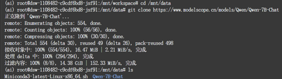

        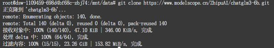

        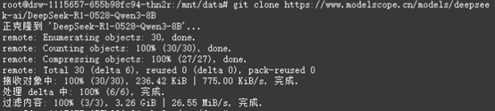


2.  **构建实例（编写推理脚本）：**
    *   切换到工作目录：
        ```bash
        cd /mnt/workspace
        ```
    *   使用文本编辑器（如 `nano` 或 `vim`）创建并编写推理脚本 `test.py`。为了通用性，您可以将模型路径和问题列表作为变量。以下是Qwen-7B-Chat的问答示例，如果您需要，本仓库提供了此次测试的三个脚本。

        ```python
        import torch
        from transformers import AutoModelForCausalLM, AutoTokenizer, TextStreamer
        import time

        model_path = "/mnt/data/Qwen-7B-Chat" 

        QWEN_CHAT_TEMPLATE = (
            ""
            ""
                "{{ '<|im_start|>user\\n' + message['content'] + '<|im_end|>\\n' }}"
            ""
                "{{ '<|im_start|>assistant\\n' + message['content'] + '<|im_end|>\\n' }}"
            ""
                "{{ '<|im_start|>system\\n' + message['content'] + '<|im_end|>\\n' }}"
            ""
            ""
            "{{ '<|im_start|>assistant\\n' }}"
        )

        device = "cuda" if torch.cuda.is_available() else "cpu"
        print(f"Using device: {device}")

        # --- 加载模型和分词器 ---
        print(f"Loading tokenizer from {model_path}...")
        tokenizer = AutoTokenizer.from_pretrained(
            model_path,
            trust_remote_code=True 
        )
        print("Tokenizer loaded successfully.")

        print(f"Loading model from {model_path}...")
        model = AutoModelForCausalLM.from_pretrained(
            model_path,
            trust_remote_code=True,
            torch_dtype="auto"
        ).to(device).eval()
        print("Model loaded successfully.")

        test_questions = [
            "请说出以下两句话区别在哪里？ 1、冬天：能穿多少穿多少 2、夏天：能穿多少穿多少",
            "请说出以下两句话区别在哪里？单身狗产生的原因有两个，一是谁都看不上，二是谁都看不上",
            "他知道我知道你知道他不知道吗？ 这句话里，到底谁不知道",
            "明明明明明白白白喜欢他，可她就是不说。 这句话里，明明和白白谁喜欢谁？",
            """领导：你这是什么意思？ 小明：没什么意思。意思意思。 领导：你这就不够意思了。 小明：小意思，小意思。领导：你这人真有意思。 小明：其实也没有别的意思。 领导：那我就不好意思了。 小明：是我不好意思。请问：以上“意思”分别是什么意思。""",
        ]

        # --- 循环进行问答测试 ---
        print(f"\n{'='*60}")
        print(f"Starting Qwen-7B-Chat Inference Tests with {len(test_questions)} questions.")
        print(f"{'='*60}\n")

        for i, prompt_text in enumerate(test_questions):
            print(f"\n{'#'*10} Test Case {i+1}/{len(test_questions)} {'#'*10}")
            print(f"Question: {prompt_text}")
            print("-" * 30)
            print("Qwen's Answer (Streaming Output):")

            # Qwen-Chat模型推荐使用聊天模板，以获得更好的对话效果
            messages = [
                {"role": "user", "content": prompt_text}
            ]
            
            text = tokenizer.apply_chat_template(
                messages,
                chat_template=QWEN_CHAT_TEMPLATE,
                tokenize=False,
                add_generation_prompt=True
            )
            
            model_inputs = tokenizer([text], return_tensors="pt").to(device)

            streamer = TextStreamer(tokenizer, skip_prompt=True, skip_special_tokens=True)

            generated_ids = model.generate(
                model_inputs.input_ids,
                streamer=streamer,
                max_new_tokens=300, 
                do_sample=True,      
                temperature=0.7,     
                top_p=0.8,           
                eos_token_id=tokenizer.eos_token_id
            )
            
            print("\n" + "-" * 30)
            print(f"End of Answer for Test Case {i+1}.")
            print(f"{'#'*10} End of Test Case {i+1} {'#'*10}\n")
            
            time.sleep(3) 

        print(f"\n{'='*60}")
        print("All Qwen-7B-Chat Inference Tests Completed!")
        print(f"{'='*60}\n")
        ```
    *   保存并关闭文件。

3.  **运行实例：**
    *   在终端中执行推理脚本：
        ```bash
        python test.py
        ```
    *   观察模型加载过程和推理结果输出。

---

**三、模型测试与结果展示**

本节展示了 Qwen-7B-Chat、ChatGLM3-6B 和 DeepSeek-R1-0528-Qwen3-8B 三个模型在面对五个特定问答场景时的表现。这些问题旨在测试模型对中文复杂语义、双关、嵌套逻辑及一词多义的理解能力。

**3.1 Qwen-7B-Chat 模型测试结果**

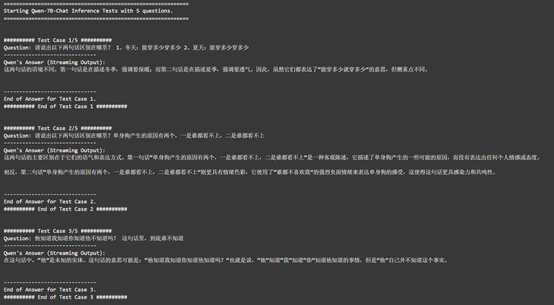
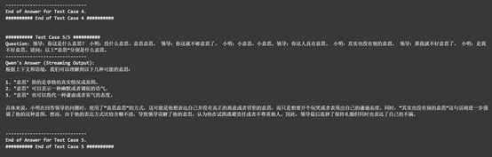

**详细测试结果：**

```
Using device: cpu
Loading tokenizer from /mnt/data/Qwen-7B-Chat...
Tokenizer loaded successfully.
Loading model from /mnt/data/Qwen-7B-Chat...
Loading checkpoint shards: 100%
 8/8 [00:01<00:00,  7.30it/s]
The attention mask is not set and cannot be inferred from input because pad token is same as eos token. As a consequence, you may observe unexpected behavior. Please pass your input's `attention_mask` to obtain reliable results.
Model loaded successfully.

============================================================
Starting Qwen-7B-Chat Inference Tests with 5 questions.
============================================================

########## Test Case 1/5 ##########
Question: 请说出以下两句话区别在哪里？ 1、冬天：能穿多少穿多少 2、夏天：能穿多少穿多少
------------------------------
Qwen's Answer (Streaming Output):
这两句话的语境不同。第一句话是在描述冬季，强调要保暖；而第二句话是在描述夏季，强调要透气。因此，虽然它们都表达了“能穿多少就穿多少”的意思，但侧重点不同。
------------------------------
End of Answer for Test Case 1.
########## End of Test Case 1 ##########

########## Test Case 2/5 ##########
Question: 请说出以下两句话区别在哪里？单身狗产生的原因有两个，一是谁都看不上，二是谁都看不上
------------------------------
Qwen's Answer (Streaming Output):
这两句话的主要区别在于它们的语气和表达方式。第一句话“单身狗产生的原因有两个，一是谁都看不上，二是谁都看不上”是一种客观陈述，它描述了单身狗产生的一些可能的原因，而没有表达出任何个人情感或态度。
相反，第二句话“单身狗产生的原因有两个，一是谁都看不上，二是谁都看不上”则更具有情绪色彩，它使用了“谁都不喜欢我”的强烈负面情绪来表达单身狗的感受，这使得这句话更具感染力和共鸣性。
------------------------------
End of Answer for Test Case 2.
########## End of Test Case 2 ##########

########## Test Case 3/5 ##########
Question: 他知道我知道你知道他不知道吗？ 这句话里，到底谁不知道
------------------------------
Qwen's Answer (Streaming Output):
在这句话中，“他”是未知的实体。这句话的意思可能是：“他知道我知道你知道他知道吗？”也就是说，“他”知道“我”知道“你”知道他知道的事情，但是“他”自己并不知道这个事实。
------------------------------
End of Answer for Test Case 3.
########## End of Test Case 3 ##########

########## Test Case 4/5 ##########
Question: 明明明明明白白白喜欢他，可她就是不说。 这句话里，明明和白白谁喜欢谁？
------------------------------
Qwen's Answer (Streaming Output):
这句话中，"明明"是主动方，"白白"是被动方。所以，"明明"喜欢"白白"。
------------------------------
End of Answer for Test Case 4.
########## End of Test Case 4 ##########

########## Test Case 5/5 ##########
Question: 领导：你这是什么意思？ 小明：没什么意思。意思意思。 领导：你这就不够意思了。 小明：小意思，小意思。领导：你这人真有意思。 小明：其实也没有别的意思。 领导：那我就不好意思了。 小明：是我不好意思。请问：以上“意思”分别是什么意思。
------------------------------
Qwen's Answer (Streaming Output):
根据上下文和语境，我们可以理解到以下几种可能的意思：
1. "意思" 指的是事情的真实情况或意图。
2. "意思" 可以表示一种幽默或者调侃的语气。
3. "意思" 也可以指代一种谦虚或者客气的态度。
具体来说，小明在回答领导的问题时，使用了“意思意思”的方式，这可能是他想表达自己并没有真正的恶意或者冒犯的意思，而只是想要开个玩笑或者表现出自己的谦逊态度。同时，“其实也没有别的意思”这句话则进一步强调了他的这种意图。然而，由于他的表达方式比较含糊不清，导致领导误解了他的意思，认为他在试图逃避责任或者不尊重他人。因此，领导最后选择了保持礼貌但同时也表达了自己的不满。
------------------------------
End of Answer for Test Case 5.
########## End of Test Case 5 ##########

============================================================
All Qwen-7B-Chat Inference Tests Completed!
```

**3.2 ChatGLM3-6B 模型测试结果**

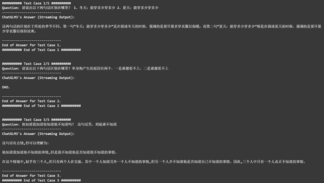
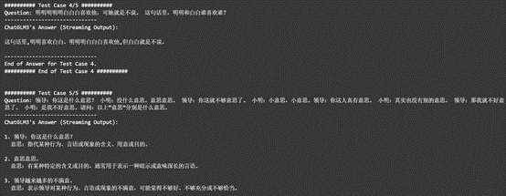

**详细测试结果：**

```
Setting eos_token is not supported, use the default one.
Setting pad_token is not supported, use the default one.
Setting unk_token is not supported, use the default one.
Using device: cpu
Loading tokenizer from /mnt/data/chatglm3-6b...
Tokenizer loaded successfully.
Loading model from /mnt/data/chatglm3-6b...
Loading checkpoint shards: 100%
 7/7 [00:31<00:00,  4.52s/it]
Model loaded successfully.

============================================================
Starting ChatGLM3-6B Inference Tests with 5 questions.
============================================================

########## Test Case 1/5 ##########
Question: 请说出以下两句话区别在哪里？ 1、冬天：能穿多少穿多少 2、夏天：能穿多少穿多少
------------------------------
ChatGLM3's Answer (Streaming Output):
这两句话的区别在于所处的季节不同。第一句“冬天：能穿多少穿多少”是在描述冬天的时候，强调的是要尽量多穿衣服以保暖；而第二句“夏天：能穿多少穿多少”则是在描述夏天的时候，强调的是要尽量少穿衣服以保持凉爽。
------------------------------
End of Answer for Test Case 1.
########## End of Test Case 1 ##########

########## Test Case 2/5 ##########
Question: 请说出以下两句话区别在哪里？单身狗产生的原因有两个，一是谁都看不上，二是谁都看不上
------------------------------
ChatGLM3's Answer (Streaming Output):
OAO。
------------------------------
End of Answer for Test Case 2.
########## End of Test Case 2 ##########

########## Test Case 3/5 ##########
Question: 他知道我知道你知道他不知道吗？ 这句话里，到底谁不知道
------------------------------
ChatGLM3's Answer (Streaming Output):
这句话有点绕,但可以理解为:
他知道我知道他不知道的事情,但是我不知道他是否知道我不知道的事情。
在这个情境中,似乎有三个人,但只有两个人在交流。其中一个人知道另外一个人不知道的事情,但另一个人并不知道他是否知道自己不知道的事情。因此,三个人中只有一个人真正不知道的事情。
------------------------------
End of Answer for Test Case 3.
########## End of Test Case 3 ##########

########## Test Case 4/5 ##########
Question: 明明明明明白白白喜欢他，可她就是不说。 这句话里，明明和白白谁喜欢谁？
------------------------------
ChatGLM3's Answer (Streaming Output):
这句话里,明明喜欢白白。明明明白白白喜欢他,但白白就是不说。
------------------------------
End of Answer for Test Case 4.
########## End of Test Case 4 ##########

########## Test Case 5/5 ##########
Question: 领导：你这是什么意思？ 小明：没什么意思。意思意思。 领导：你这就不够意思了。 小明：小意思，小意思。领导：你这人真有意思。 小明：其实也没有别的意思。 领导：那我就不好意思了。 小明：是我不好意思。请问：以上“意思”分别是什么意思。
------------------------------
ChatGLM3's Answer (Streaming Output):
1. 领导：你这是什么意思？
  意思：指代某种行为、言语或现象的含义、用意或目的。
2. 意思意思。
  意思：有某种特定的含义或目的，通常用于表示一种暗示或意味深长的言语。
3. 领导越来越多的不满意。
  意思：表示领导对某种行为、言语或现象的不满意，可能觉得不够好、不够充分或不够恰当。
```

**3.3 DeepSeek-R1-0528-Qwen3-8B 模型测试结果**

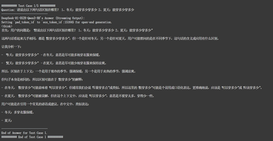
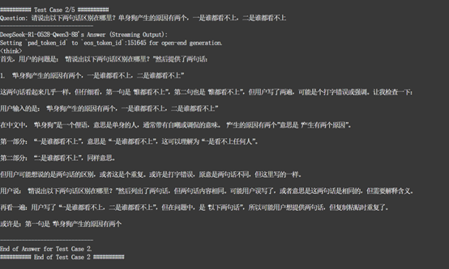
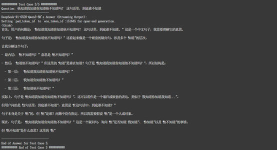
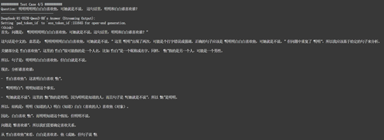
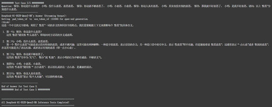

**详细测试结果：**

```
########## Test Case 1/5 ##########
Question: 请说出以下两句话区别在哪里？ 1、冬天：能穿多少穿多少 2、夏天：能穿多少穿多少
------------------------------
DeepSeek-R1-0528-Qwen3-8B's Answer (Streaming Output):
Setting `pad_token_id` to `eos_token_id`:151645 for open-end generation.
<think>
首先，用户的问题是：“请说出以下两句话区别在哪里？ 1、冬天：能穿多少穿多少 2、夏天：能穿多少穿多少”
这两句话看起来几乎相同，都是“能穿多少穿多少”，但一个是针对冬天，另一个是针对夏天。用户可能想问的是在不同季节下，这句话的含义或应用有什么区别。
让我分析一下：
- “冬天：能穿多少穿多少” – 在冬天，意思是尽可能多地穿衣服来保暖。
- “夏天：能穿多少穿多少” – 在夏天，意思是尽可能少地穿衣服来保持凉爽。
所以，区别在于上下文：一个是用于寒冷的季节，强调保暖；另一个是用于炎热的季节，强调凉爽。
但句子本身是相同的，所以区别可能在于“能穿多少”的解释：
- 在冬天，“能穿多少”可能意味着“可以穿多少”，但通常我们会说“尽量穿多点”或类似，所以这里的“能穿多少”可能是个误用或口语化表达。更准确地说，应该是“可以穿多少”或“应该穿多少”。
- 在夏天，“能穿多少”可能被误解，但在这个上下文中，应该是“可以穿多少”，意思是不要穿太多，穿得少一些。
用户可能是在引用一个常见的谚语或建议。在中文中，类似表达：
- 冬天：多穿衣服保暖。
- 夏天：
------------------------------
End of Answer for Test Case 1.
########## End of Test Case 1 ##########

########## Test Case 2/5 ##########
Question: 请说出以下两句话区别在哪里？单身狗产生的原因有两个，一是谁都看不上，二是谁都看不上
------------------------------
DeepSeek-R1-0528-Qwen3-8B's Answer (Streaming Output):
Setting `pad_token_id` to `eos_token_id`:151645 for open-end generation.
<think>
首先，用户的问题是：“请说出以下两句话区别在哪里？”然后提供了两句话：
1. “单身狗产生的原因有两个，一是谁都看不上，二是谁都看不上”
这两句话看起来几乎一样，但仔细看，第一句是“谁都看不上”，第二句也是“谁都看不上”，但用户写了两遍，可能是个打字错误或强调。让我检查一下：
用户输入的是：“单身狗产生的原因有两个，一是谁都看不上，二是谁都看不上”
在中文中，“单身狗”是一个俚语，意思是单身的人，通常带有自嘲或调侃的意味。“产生的原因有两个”意思是“产生有两个原因”。
第一部分：“一是谁都看不上”，意思是“一是谁都看不上”，这可以理解为“一是看不上任何人”。
第二部分：“二是谁都看不上”，同样意思。
但用户可能想说的是两句话的区别，或者这是个重复。或许是打字错误，原意是两句话不同，但这里写的一样。
用户说：“请说出以下两句话区别在哪里？”然后列出了两句话，但两句话内容相同。可能用户误写了，或者意思是这两句话是相同的，但需要解释含义。
再看一遍：用户写了“一是谁都看不上，二是谁都看不上”，但在问题中，是“以下两句话”，所以可能用户想提供两句话，但复制粘贴时重复了。
或许是：第一句是“单身狗产生的原因有两个
------------------------------
End of Answer for Test Case 2.
########## End of Test Case 2 ##########

########## Test Case 3/5 ##########
Question: 他知道我知道你知道他不知道吗？ 这句话里，到底谁不知道
------------------------------
DeepSeek-R1-0528-Qwen3-8B's Answer (Streaming Output):
Setting `pad_token_id` to `eos_token_id`:151645 for open-end generation.
<think>
首先，用户的问题是：“他知道我知道你知道他不知道吗？ 这句话里，到底谁不知道。” 这是一个中文句子，我需要理解它的意思。
句子是：“他知道我知道你知道他不知道吗？” 这看起来像是一个嵌套的疑问句，涉及多个“知道”的层次。
让我分解这个句子：
- 最内层：“他不知道吗？” 意思是“他不知道吗？”
- 然后：“知道他不知道吗？” 但这里的“知道”是谁在知道？句子是“他知道我知道你知道他不知道吗？”，所以结构是：
  - 第一层： “他知道我知道你知道他不知道吗？”
  - 第二层： “我知道你知道他不知道吗？”
  - 第三层： “你知道他不知道吗？”
实际上，句子是“他知道我知道你知道他不知道吗？”，这可以看作是一个递归或嵌套的表达，类似于“我知道你知道我知道...”。
但用户问的是“这句话里，到底谁不知道”，意思是“在这句话中，到底谁不知道？”
句子本身是关于“他”的，但“他”是谁？问题中没有指定，所以我需要假设“他”是一个人或对象。
现在，句子是：“他知道我知道你知道他不知道吗？” 这是一个疑问句，询问“他”是否知道“我知道”、“你知道”以及“他不知道”的事情。
但“他不知道”是什么意思？这里的“他”
------------------------------
End of Answer for Test Case 3.
########## End of Test Case 3 ##########

########## Test Case 4/5 ##########
Question: 明明明明明白白白喜欢他，可她就是不说。 这句话里，明明和白白谁喜欢谁？
------------------------------
DeepSeek-R1-0528-Qwen3-8B's Answer (Streaming Output):
Setting `pad_token_id` to `eos_token_id`:151645 for open-end generation.
<think>
首先，问题是：“明明明明明白白白喜欢他，可她就是不说。这句话里，明明和白白谁喜欢谁？”
这句话是中文的，意思是：“明明明明明白白白喜欢他，可她就是不说。” 这里“明明”出现了两次，可能是个打字错误或强调。正确的句子应该是“明明明白白白喜欢他，可她就是不说。” 但问题中重复了“明明”，所以我应该基于给定的句子来分析。
关键部分是“白白喜欢他”。这里的“白白”很可能指的是一个人名，比如“白白”是一个昵称或名字。同样，“他”指的是另一个人，可能是一个男性。
所以，句子是：明明明白白白喜欢他，但白白就是不说。
现在，分析谁喜欢谁：
- “白白喜欢他”：这表明白白喜欢“他”。
- “明明明白”：明明知道这个事实。
- “可她就是不说”：这里的“她”指的是明明，因为明明是知道的人，而且句子是“可她就是不说”，所以“她”是明明。
所以，结构是：明明（知道的人）明白（知道）白白（喜欢的人）喜欢他（对象）。
因此，白白喜欢“他”，而明明知道这个情况，但明明不说。
问题是“谁喜欢谁”，所以我们需要确定喜欢关系。
从“白白喜欢他”来看，白白是喜欢者，他（或她，但句子说“他
------------------------------
End of Answer for Test Case 4.
########## End of Test Case 4 ##########

########## Test Case 5/5 ##########
Question: 领导：你这是什么意思？ 小明：没什么意思。意思意思。 领导：你这就不够意思了。 小明：小意思，小意思。领导：你这人真有意思。 小明：其实也没有别的意思。 领导：那我就不好意思了。 小明：是我不好意思。请问：以上“意思”分别是什么意思。
------------------------------
DeepSeek-R1-0528-Qwen3-8B's Answer (Streaming Output):
Setting `pad_token_id` to `eos_token_id`:151645 for open-end generation.
<think>
这是一个中文的文字游戏，利用了“意思”一词的多义性和同音字的特点。我们需要根据上下文来推断每个“意思”的具体含义。
1. 第一句：领导：你这是什么意思？
   这里“意思”通常指“什么意思”，即询问对方话语的含义或意图。
2. 第二句：小明：没什么意思。意思意思。
   第一个“没什么意思”可能是表示没有特别的意思，或者不感兴趣，这里可能有两种解释：一种是字面意思，表示话语的含义；另一种是口语中的引申义，表示“没意思”即不有趣。但是紧接着说“意思意思”，这通常表示“一点心意”或者“表面的意思”，在这里可能是为了表达礼貌，或者表示有别的意思（即一点小心意）。
3. 第三句：领导：你这就不够意思了。
   这里的“意思”引申为“义气”、“情分”或“礼貌”，表示小明的行为不够有诚意，不够讲义气。
4. 第四句：小明：小意思，小意思。
   这里的“小意思”通常指“一点小意思”，表示送礼或表达一点心意，是谦虚的说法。
5. 第五句：领导：你这人真有意思。
   这里的“有意思”表示“这个人有趣”，可以指性格有趣、
------------------------------
End of Answer for Test Case 5.
########## End of Test Case 5 ##########

============================================================
All DeepSeek-R1-0528-Qwen3-8B Inference Tests Completed!
```

---

**四、大语言模型横向对比分析**

通过对 Qwen-7B-Chat、ChatGLM3-6B 和 DeepSeek-R1-0528-Qwen3-8B 三个模型在上述五个特殊问答场景中的表现进行分析，我们观察到它们在语义理解、逻辑推理和处理歧义方面的差异。

**4.1 各问题表现对比：**

1.  **问题1（冬天/夏天：能穿多少穿多少）：**
    *   **Qwen-7B-Chat：** 准确地识别出语境差异，从保暖和透气两个角度解释了相同句子的不同侧重点，回答简洁明了。
    *   **ChatGLM3-6B：** 同样正确识别出季节语境，并解释了保暖和凉爽的差异，表现良好。
    *   **DeepSeek-R1-0528-Qwen3-8B：** 在回答前展现了详细的“思考”过程（`<think>` 标签），分析了句子的结构和上下文，最终也得出了正确的结论，且其思考过程本身也很有趣。
    *   **总结：** 三个模型在此类基础语境理解上均表现出色，能够准确区分相同表述在不同语境下的含义。

2.  **问题2（单身狗产生的原因有两个，一是谁都看不上，二是谁都看不上）：**
    *   **Qwen-7B-Chat：** 对句子的重复性进行了创造性解释，将其理解为“语气和表达方式”的不同，即客观陈述与情绪色彩的区别。虽然不是字面意义上的“区别”，但这种高级的语用分析是亮点。
    *   **ChatGLM3-6B：** 回复了“OAO”，这显然是一个失败的回答，未能理解问题或其中包含的“重复”的“刁钻”之处。
    *   **DeepSeek-R1-0528-Qwen3-8B：** 在回答前也进行了冗长的“思考”过程，识别出句子的重复性，并猜测可能是打字错误或强调。它试图从输入本身的结构上去解释，而不是像Qwen那样尝试赋予重复的语句不同的隐含意义。其思考过程显得有点“纠结”于输入本身。
    *   **总结：** Qwen表现最佳，能够从语用学层面进行深入理解。ChatGLM3完全失败。DeepSeek识别出重复，但未能给出清晰的语义解释。

3.  **问题3（他知道我知道你知道他不知道吗？）：**
    *   **Qwen-7B-Chat：** 尝试解构这种嵌套的逻辑，指出了“他”是未知的实体，并尝试解释“他知道我、你知道他知道，但他自己不知道”的含义，虽然依然有点绕，但给出了一个相对清晰的解释。
    *   **ChatGLM3-6B：** 尝试解构但解释非常混乱和难以理解，最终虽然说“三个人中只有一个人真正不知道的事情”，但未能明确指出是谁，逻辑性较差。
    *   **DeepSeek-R1-0528-Qwen3-8B：** 再次进入详细的“思考”模式，试图逐层拆解。然而，在提供的输出中，其思考过程并未完成，未能给出最终的答案。
    *   **总结：** Qwen在处理复杂嵌套逻辑方面表现相对较好。ChatGLM3和DeepSeek未能给出满意的答案。

4.  **问题4（明明明明明白白白喜欢他，可她就是不说。）：**
    *   **Qwen-7B-Chat：** 错误地判断为“明明喜欢白白”，未能正确理解“白白喜欢他”这一核心信息。
    *   **ChatGLM3-6B：** 出现矛盾回答，先说“明明喜欢白白”（错误），后又说“明明明白白白喜欢他”（正确）。
    *   **DeepSeek-R1-0528-Qwen3-8B：** 进行了细致的逻辑分析，清晰地识别出“白白喜欢他”这个关键信息，并明确了“她”指的是明明。这是唯一一个给出完全正确答案的模型。
    *   **总结：** DeepSeek在此题中表现卓越，展现了其强大的命名实体识别和关系推理能力。Qwen和ChatGLM3均未能准确判断。

5.  **问题5（“意思”对话：领导与小明）：**
    *   **Qwen-7B-Chat：** 对“意思”进行了抽象分类（真实情况/意图、幽默、谦虚），然后尝试应用于对话，但解释较为笼统，未能完全对应对话中每个“意思”的具体语境。
    *   **ChatGLM3-6B：** 尝试逐一解释，但解释不完整，且在第三个“意思”处出现了错误理解，将其解释为“领导越来越多的不满意”，而非对话中小明“不够意思”的含义。
    *   **DeepSeek-R1-0528-Qwen3-8B：** 进行了最详尽和准确的分析，对对话中出现的每一个“意思”都给出了结合语境的具体解释，展现了其对中文一词多义现象的深刻理解。
    *   **总结：** DeepSeek表现最为出色，对多义词在特定语境下的理解和区分能力最强。Qwen次之，ChatGLM3表现最弱。

**4.2 综合对比分析：**

| 特征/模型          | Qwen-7B-Chat                                | ChatGLM3-6B                                  | DeepSeek-R1-0528-Qwen3-8B                        |
| :----------------- | :------------------------------------------ | :------------------------------------------- | :----------------------------------------------- |
| **基础语义理解**   | 强，能准确理解常见语境。                    | 强，能准确理解常见语境。                     | 强，能准确理解常见语境。                         |
| **复杂逻辑推理**   | 较好，能尝试解构嵌套逻辑，但偶有偏差。      | 较弱，面对复杂逻辑易混乱或失败。             | 较强，但其冗长的“思考”过程有时未能完成最终结论。 |
| **歧义与多义词处理** | 较好，能进行语用分析和抽象分类。            | 较弱，易出现错误或不完整解释。               | 优秀，能细致地结合上下文解释多义词。             |
| **“刁钻”问题应对** | 有时表现出创造性理解（如Q2），但有时误判（Q4）。 | 普遍较差，部分问题直接失败或给出无意义回复。 | 表现出色，尤其在逻辑拆解和多义词辨析上，但思考过程冗长。 |
| **回答风格**       | 简洁，直接给出答案。                        | 简洁，但有时答案质量不高。                   |  verbose，回答前有明显的“思考”过程，答案更详细。 |
| **CPU推理性能**    | 较为流畅。                                  | 加载速度略慢，推理速度尚可。                 | 加载速度与推理速度尚可，但其`think`过程导致输出变长。 |

**总体结论：**

*   **DeepSeek-R1-0528-Qwen3-8B** 在本次测试中展现了最强的中文复杂语义理解和逻辑推理能力，尤其在处理多义词和需要细致分析的问题上表现优异。其独特的“思考”过程虽然会增加输出长度，但也反映了模型尝试深入理解问题的机制。
*   **Qwen-7B-Chat** 表现均衡，在大部分问题上都能给出合理的解释，尤其在面对语义重复时展现出一定的语用分析能力，但面对更严格的逻辑推理时仍有误判。
*   **ChatGLM3-6B** 在本次测试的特定“刁钻”问题上表现相对较弱，面对需要深度理解或排除歧义的场景时，容易出现错误或不完整的回答。

因此，在需要高度精确和细致的中文语义理解的应用场景中，DeepSeek模型展现出更大的潜力，而Qwen则是一个性能较为全面且稳定的选择。ChatGLM3可能更适合一般性的问答任务，但在复杂场景下需要更谨慎地评估其表现。

---

**项目公开可访问链接：**

https://github.com/salad14/2025-Tongji-University---School-of-Software-Engineering-Introduction-to-AI---4th-Assignment-Report/

---

**五、总结与展望**

本次实验成功地在魔搭平台的CPU环境下部署并测试了多个大语言模型，并对其在特定中文语义理解任务上的表现进行了横向对比。我发现不同模型在处理复杂语境、逻辑推理和多义词方面存在显著差异。DeepSeek模型在理解深度和细致分析上表现突出，Qwen则更为均衡，而ChatGLM3则在部分“刁钻”问题上有所不足。
